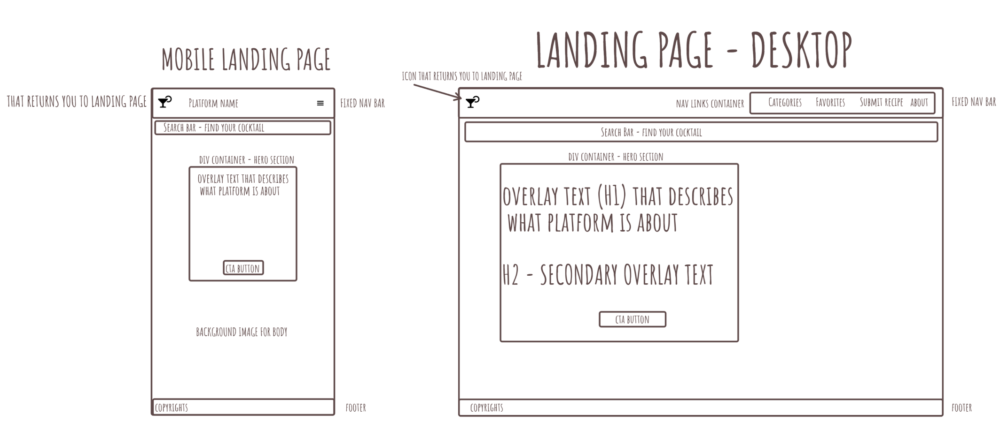
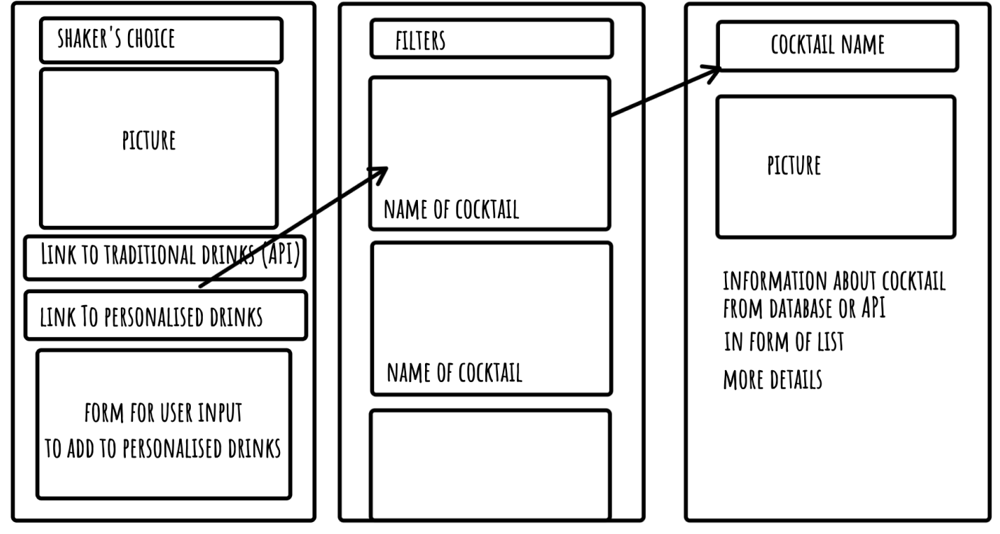
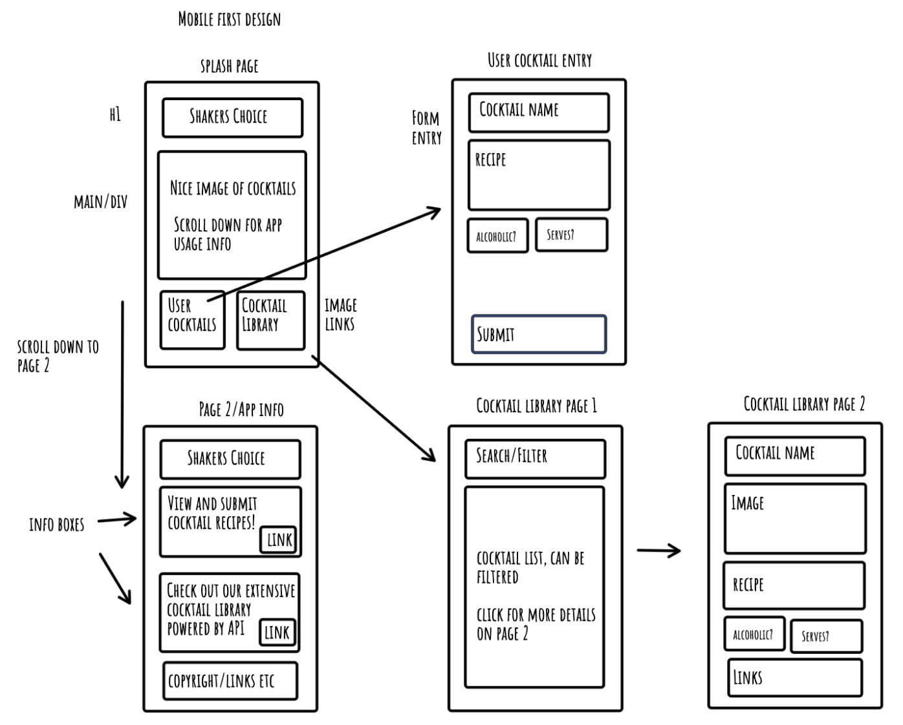
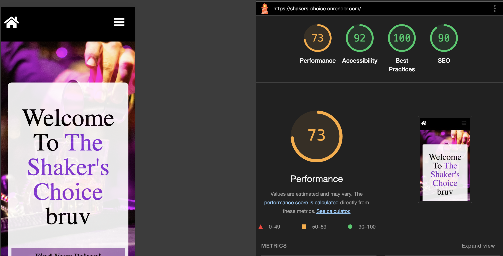
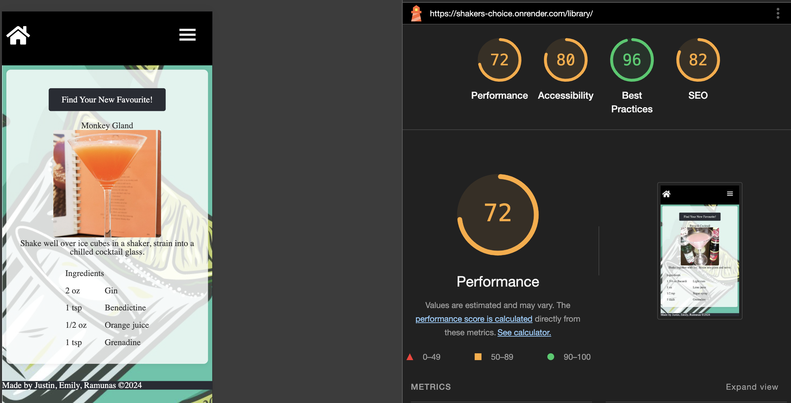
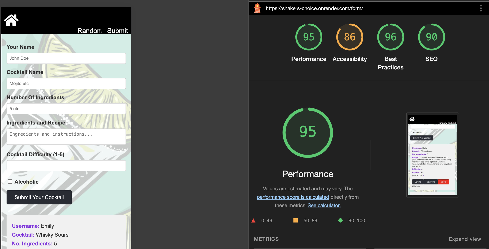

# TechEd-Week05-Assignment

Group Assignment Emily, Justin and Ramunas. Shaker's Choice Cocktail App, with user submissions and public API cocktail library.

Project name: Shaker's Choice

## Render links:

https://shakers-choice.onrender.com/ - App
https://teched-week05-assignment.onrender.com

## Repo link:

https://github.com/skgtjt1/TechEd-Week05-Assignment

# Team members:

Emily, Ramunas and Justin

# Project description:

A site which allows users to access a cocktail database and also upload their own creations.

# Problem domain:

There are so many cocktails out there it's hard to keep track! Wouldn't it be nice to be able to look up your favourites, submit your own creations and get suggestions for tasty cocktails?

User stories:

- I want to be able to search and filter the cocktail recipe lists.
- I want to check each recipe in detail and see their ingredients / how to make it.
- I want to add recipes to favorites and view them separately.
- I want to add custom recipes to the platform.
- I want to mainly use the platform on my phone.
- I want a random cocktail suggested to me.

# Wireframe:

A list of any libraries, frameworks, or packages that your application requires in order to properly function:
Express.js, pg, cors...

Lighthouse report:

# Lighthouse scores:

Reflections:

Please mention the requirements you met and which goals you achieved for this assignment.

# Stretch goals achieved:

Delete button and vote buttons also added date of entry. Delete button was interesting because we had to find a simple way to make sure it only deleted a specific entry. Found a method of passing the entry id through to the server from the client which seems to work well.

Next steps for this feature: Limit only one vote per person. Ideally a log in system but a localstorage flag could maybe do the job however this could easily be circumvented.

# Were there any requirements or goals that you were not quite able to achieve?

Wasn’t able to make the responsiveness and layout as good and as complete as planned.
Wasn’t able to implement another container for when you click on the cocktail it shows all the cocktail details, ingredients, picture and instructions how to make it.

# If so, could you please tell us what was it that you found difficult about these tasks?

Some positionings broke after extra content was added and in the end was not able to fix them to make final version look great.
Didn’t have enough time to make the container and all the API details for each drink, was struggling with media queries and breakpoints, some media queries were interfering with each other and that caused a lot of issues, probably wasn’t using them correctly.

# What went really well and what could have gone better?

The design of our app went really well, our planning and daily collaboration was good and fun. I feel I would have liked to contribute more to other aspects of the app, but since we have done a multi-page app it felt right for each of us to work on one page each.
Would have liked to have done more functions for our app, for user to be able to do more.
Would have liked the app to look and feel more finished, but am very happy with what each struggle and break point has taught us along the way.
Detailing useful external sources that helped you complete the assignment (e.g Youtube tutorials).
Youtube Channel - Gary Simons UI/UX designs (very useful for UI/UX design/planning and implementations)
Often referred back to MDN, W3School, Stack Overflow for documentations, syntax and better understanding of how to solve issues that arose during each stage of the assignment.

# Detailing useful external sources that helped you complete the assignment (e.g Youtube tutorials).

[Cocktail API beginner tutorial](https://www.youtube.com/watch?v=zyIhHf4pljo)
ChatGPT / copilot for debugging. SQL editor on Supabase.

# Describing errors or bugs you encountered while completing your assignment.

- Layouts - positioning, spacing and responsiveness of components within the page were sometimes behaving how they were not intended to behave, or adding new elements to the page broke previously working elements.

- Positioning things with “absolute/relative” + media queries which change into display flex/grid also gave a hard time in resolving layout issues.

- Media queries. Still not good at using them well, unsure when to best use them at what breaking points and in a way that it wont impact or break other media queries or elements on the page (which happened a LOT).

# References:

Third-party APIs, CSS resets, icons, images...

- [CSS reset](https://meyerweb.com/eric/tools/css/reset/)
- Adobe free stock images
- [The CocktailDB Free API](https://www.thecocktaildb.com/api.php)

# Current bug list:

- upvote and downvote change the order of the saved user cocktails
- nav hamburger icon in user cocktails page is not styled well
